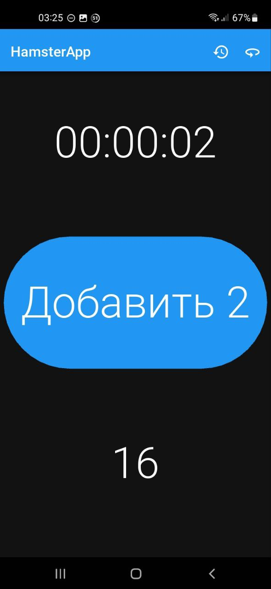
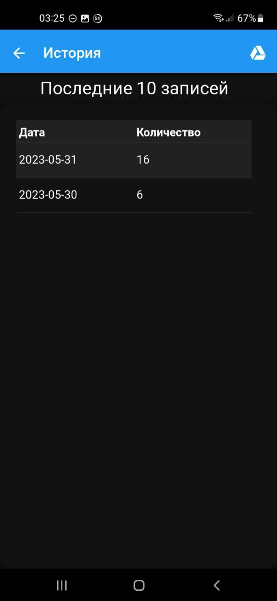

# Описание
Вторая версия приложения, полностью переделанная на Kivy.

# Идея
Для работы на кране, необходимо приложение для подсчёта поднятых материалов, с таймером, отсчитывающим время с последнего подъёма, а так же с историей и возможностью экспортировать её в гугл-таблицы

# ТЗ
- Сделать вместо PWA приложения, полноценный APK
- Приложение должно работать без интернета
- Приложение должно хранить результаты других дней
- Должна быть возможность экспортировать в гуглтаблицу записи, которых там нет
- Приложение должно отображать 10 последних дней

# Реализация
Для реализации приложение было переписано с использованием библиотек `Kivy`, `KivyMD`, `gspread`

# Первоначальная версия
Находится в ветке [first-version](https://github.com/proDreams/HamsterApp/tree/first-version)

# Скриншоты
### Основной экран

### Экран истории
